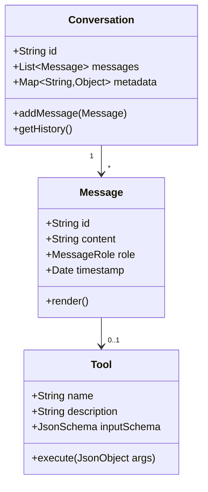
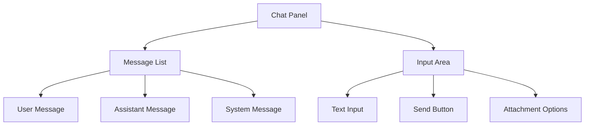
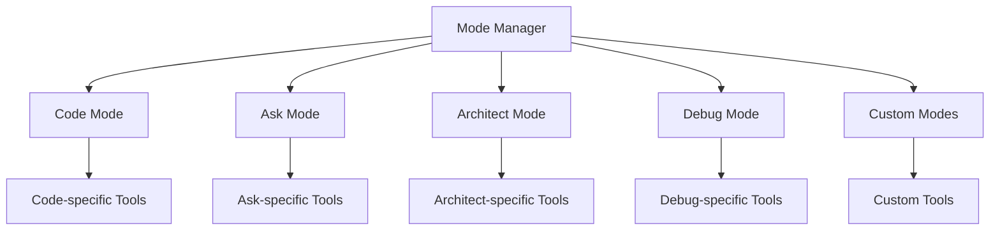
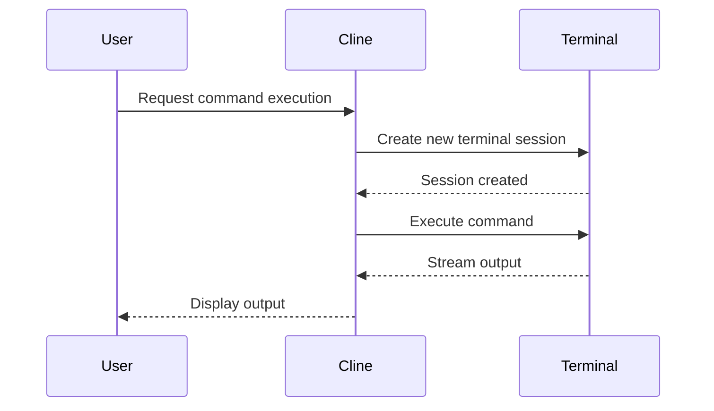

# Cline for JetBrains IDEs: Java Implementation Plan

## Project Overview

This document outlines the comprehensive plan for rebuilding the Cline plugin for JetBrains IDEs using pure Java. The goal is to create a 1:1 clone of the VSCode version with exact feature parity, using native JetBrains UI components instead of the TypeScript bridge approach.

### Objectives

- Create a pure Java implementation with exact feature parity to the VSCode version
- Maintain the same look and feel as the TypeScript version
- Use native JetBrains UI components and APIs
- Ensure compatibility across all JetBrains IDEs
- Provide the same user experience and workflow

## Current Status Assessment

The existing cline-jetbrains-java project has:

- Basic plugin infrastructure set up
- Simple UI with a tool window and tabs
- Core services for API, file operations, terminal, and settings
- Settings UI with configuration options
- Build configuration using Gradle

However, the implementation is still in early stages and lacks:

- Advanced UI components matching the VSCode experience
- Complete API integration for all AI models
- Browser functionality
- Advanced terminal integration
- Code editing capabilities
- Chat history and conversation management
- Markdown rendering
- Tool execution framework
- MCP (Model Context Protocol) support

## Detailed Implementation Plan

### Phase 1: Core Architecture (3-4 weeks)

#### 1.1 Domain Models
- Create Java equivalents of all TypeScript interfaces and classes
- Implement proper serialization/deserialization for persistence
- Ensure all data structures match the VSCode version



#### 1.2 API Integration
- Implement clients for all supported AI providers (Claude, GPT-4, etc.)
- Create streaming response handlers
- Implement token counting and management
- Add proper error handling and retry logic

#### 1.3 Plugin Architecture
- Set up dependency injection framework
- Implement service lifecycle management
- Create event bus for component communication
- Establish plugin state management

### Phase 2: UI Framework (4-5 weeks)

#### 2.1 Chat Interface
- Implement chat panel with message history
- Create message bubbles with role-based styling
- Add input area with markdown support
- Implement proper scrolling and focus management



#### 2.2 Markdown Rendering
- Create custom markdown parser and renderer
- Implement syntax highlighting for code blocks
- Add support for tables, lists, and other markdown elements
- Ensure proper styling that matches JetBrains themes

#### 2.3 Tool Window Components
- Implement tabbed interface for different modes
- Create new task panel
- Add settings panel
- Implement mode switcher

#### 2.4 Custom UI Components
- Create custom editor components for code snippets
- Implement syntax highlighting
- Add support for code actions
- Create custom buttons and controls

### Phase 3: Core Functionality (4-5 weeks)

#### 3.1 Conversation Management
- Implement conversation creation and management
- Add support for conversation history
- Create conversation export/import
- Implement conversation search

#### 3.2 Mode System
- Create mode infrastructure
- Implement mode switching
- Add support for custom instructions per mode
- Create mode-specific UI elements



#### 3.3 Settings Management
- Implement settings persistence
- Create settings UI
- Add validation for settings
- Implement settings migration

#### 3.4 Authentication
- Implement API key management
- Add token validation
- Create secure storage for credentials
- Implement authentication UI

### Phase 4: Tool Integration (5-6 weeks)

#### 4.1 File System Tools
- Implement read_file tool
- Create write_to_file tool
- Add apply_diff tool
- Implement list_files tool
- Create search_files tool
- Add list_code_definition_names tool

#### 4.2 Terminal Integration
- Implement execute_command tool
- Create terminal output capture
- Add support for interactive commands
- Implement terminal session management



#### 4.3 Browser Integration
- Implement browser_action tool
- Create JCEF-based browser component
- Add screenshot capabilities
- Implement browser navigation
- Create browser session management

#### 4.4 MCP Integration
- Implement use_mcp_tool tool
- Create access_mcp_resource tool
- Add MCP server discovery
- Implement MCP protocol client

### Phase 5: Advanced Features (3-4 weeks)

#### 5.1 Context Management
- Implement sliding window context
- Create context mentions
- Add file context extraction
- Implement context prioritization

#### 5.2 Tool Execution Framework
- Create tool registry
- Implement tool execution pipeline
- Add tool result handling
- Create tool error management

#### 5.3 Editor Integration
- Implement code insertion
- Add code navigation
- Create code search
- Implement refactoring support

#### 5.4 Diagnostics and Logging
- Create diagnostic tools
- Implement logging framework
- Add telemetry (optional)
- Create error reporting

### Phase 6: Testing and Polishing (3-4 weeks)

#### 6.1 Comprehensive Testing
- Create unit tests for all components
- Implement integration tests
- Add UI tests
- Create performance benchmarks

#### 6.2 Performance Optimization
- Optimize UI rendering
- Implement background processing
- Add caching for frequently used data
- Optimize memory usage

#### 6.3 Documentation
- Create developer documentation
- Write user guides
- Add inline code documentation
- Create sample projects

#### 6.4 Final Polish
- Ensure consistent UI styling
- Fix any remaining bugs
- Add final touches to match VSCode experience
- Perform cross-IDE testing

## Technical Approach

### Java UI Implementation Strategy

To achieve a 1:1 clone of the VSCode UI in Java, we'll use:

1. **JetBrains UI Components**: Leverage JetBrains' UI framework for native look and feel
2. **Custom Components**: Create custom components where needed to match VSCode UI
3. **Swing/AWT Extensions**: Extend standard Java UI components with custom rendering
4. **JCEF Integration**: Use Chromium Embedded Framework for browser functionality

### Code Structure Mapping

| VSCode TypeScript Structure | JetBrains Java Structure |
|----------------------------|--------------------------|
| src/api/ | com.cline.api.* |
| src/core/ | com.cline.core.* |
| src/integrations/ | com.cline.integrations.* |
| src/services/ | com.cline.services.* |
| src/shared/ | com.cline.shared.* |
| src/utils/ | com.cline.utils.* |
| webview-ui/ | com.cline.ui.* |

### Key Components to Implement

1. **Chat UI**: Implement the chat interface with message history, input area, and markdown rendering
2. **Tool Execution**: Create the tool execution framework with support for all VSCode tools
3. **API Integration**: Implement API clients for all supported AI models
4. **Browser Integration**: Create a JCEF-based browser component for web access
5. **Terminal Integration**: Implement terminal command execution and output capture
6. **File Operations**: Create file system tools for reading, writing, and searching files
7. **Settings Management**: Implement settings persistence and UI
8. **Mode System**: Create the mode infrastructure with support for custom modes
9. **MCP Support**: Implement the Model Context Protocol client

## Implementation Details

### Chat UI Implementation

The chat UI will be implemented using JetBrains UI components to match the VSCode experience:

```java
public class ChatPanel extends JPanel {
    private final JBList<Message> messageList;
    private final MessageListModel messageModel;
    private final JTextArea inputArea;
    private final JButton sendButton;
    
    public ChatPanel() {
        setLayout(new BorderLayout());
        
        // Message list
        messageModel = new MessageListModel();
        messageList = new JBList<>(messageModel);
        messageList.setCellRenderer(new MessageCellRenderer());
        JBScrollPane scrollPane = new JBScrollPane(messageList);
        add(scrollPane, BorderLayout.CENTER);
        
        // Input area
        JPanel inputPanel = new JPanel(new BorderLayout());
        inputArea = new JTextArea(3, 20);
        JBScrollPane inputScrollPane = new JBScrollPane(inputArea);
        sendButton = new JButton("Send");
        
        inputPanel.add(inputScrollPane, BorderLayout.CENTER);
        inputPanel.add(sendButton, BorderLayout.EAST);
        add(inputPanel, BorderLayout.SOUTH);
        
        // Add listeners
        sendButton.addActionListener(e -> sendMessage());
        inputArea.addKeyListener(new KeyAdapter() {
            @Override
            public void keyPressed(KeyEvent e) {
                if (e.getKeyCode() == KeyEvent.VK_ENTER && e.isControlDown()) {
                    sendMessage();
                    e.consume();
                }
            }
        });
    }
    
    private void sendMessage() {
        String text = inputArea.getText().trim();
        if (!text.isEmpty()) {
            // Process and send message
            inputArea.setText("");
        }
    }
}
```

### Markdown Rendering

Markdown rendering will be implemented using a custom renderer that leverages JetBrains editor components:

```java
public class MarkdownRenderer {
    private final Project project;
    
    public MarkdownRenderer(Project project) {
        this.project = project;
    }
    
    public JComponent render(String markdown) {
        JPanel panel = new JPanel(new BorderLayout());
        
        // Parse markdown
        Node document = Parser.builder().build().parse(markdown);
        
        // Create editor component
        EditorFactory editorFactory = EditorFactory.getInstance();
        Document document = editorFactory.createDocument("");
        Editor editor = editorFactory.createViewer(document, project);
        
        // Apply styling
        editor.getSettings().setFoldingOutlineShown(false);
        editor.getSettings().setLineMarkerAreaShown(false);
        editor.getSettings().setLineNumbersShown(false);
        editor.getSettings().setVirtualSpace(false);
        
        // Render markdown to editor
        renderMarkdown(document, editor);
        
        panel.add(editor.getComponent(), BorderLayout.CENTER);
        return panel;
    }
    
    private void renderMarkdown(Node document, Editor editor) {
        // Implementation of markdown rendering
    }
}
```

### Tool Execution Framework

The tool execution framework will be implemented to support all VSCode tools:

```java
public class ToolExecutor {
    private final Map<String, Tool> tools = new HashMap<>();
    
    public ToolExecutor() {
        registerTools();
    }
    
    private void registerTools() {
        // Register all tools
        tools.put("read_file", new ReadFileTool());
        tools.put("write_to_file", new WriteToFileTool());
        tools.put("apply_diff", new ApplyDiffTool());
        tools.put("list_files", new ListFilesTool());
        tools.put("search_files", new SearchFilesTool());
        tools.put("execute_command", new ExecuteCommandTool());
        tools.put("browser_action", new BrowserActionTool());
        // ... register other tools
    }
    
    public CompletableFuture<ToolResult> executeTool(String toolName, JsonObject args) {
        Tool tool = tools.get(toolName);
        if (tool == null) {
            return CompletableFuture.failedFuture(
                    new IllegalArgumentException("Unknown tool: " + toolName));
        }
        
        return tool.execute(args);
    }
}
```

### Browser Integration

Browser integration will be implemented using JCEF (Chromium Embedded Framework):

```java
public class BrowserComponent {
    private final JBCefBrowser browser;
    private final Project project;
    
    public BrowserComponent(Project project) {
        this.project = project;
        this.browser = new JBCefBrowser();
    }
    
    public JComponent getComponent() {
        return browser.getComponent();
    }
    
    public void loadUrl(String url) {
        browser.loadURL(url);
    }
    
    public CompletableFuture<byte[]> takeScreenshot() {
        CompletableFuture<byte[]> future = new CompletableFuture<>();
        
        browser.getCefBrowser().getDevTools().executeCommand("Page.captureScreenshot", null, 
            (response, error) -> {
                if (error != null) {
                    future.completeExceptionally(new RuntimeException(error));
                    return;
                }
                
                try {
                    String data = response.getString("data");
                    byte[] imageBytes = Base64.getDecoder().decode(data);
                    future.complete(imageBytes);
                } catch (Exception e) {
                    future.completeExceptionally(e);
                }
            });
        
        return future;
    }
    
    public void click(int x, int y) {
        // Implementation for clicking at coordinates
    }
    
    public void type(String text) {
        // Implementation for typing text
    }
    
    public void scrollDown() {
        // Implementation for scrolling down
    }
    
    public void scrollUp() {
        // Implementation for scrolling up
    }
    
    public void close() {
        browser.dispose();
    }
}
```

## Resource Requirements

### Development Team
- 3-4 Java developers with JetBrains plugin experience
- 1 UI/UX designer familiar with JetBrains design patterns
- 1-2 QA engineers for testing across multiple IDEs

### Tools and Infrastructure
- JetBrains Plugin SDK
- CI/CD pipeline for automated testing and deployment
- Testing environments for different JetBrains IDEs

## Timeline and Milestones

**Total Estimated Time: 20-24 weeks**

1. **Milestone 1 (Week 4):** Core architecture and domain models implemented
2. **Milestone 2 (Week 9):** Basic UI framework with chat interface and markdown rendering
3. **Milestone 3 (Week 14):** Core functionality including conversation management and mode system
4. **Milestone 4 (Week 20):** Tool integration with file, terminal, browser, and MCP support
5. **Milestone 5 (Week 24):** Advanced features, testing, and final polish

## Risks and Mitigation

| Risk | Mitigation |
|------|------------|
| JetBrains platform limitations | Early research on platform capabilities and alternative approaches |
| Performance issues with complex UI | Incremental development with performance testing at each stage |
| Compatibility across different IDEs | Regular testing on multiple IDE versions |
| API changes in JetBrains platform | Follow best practices for plugin development and monitor EAP releases |
| Complexity of 1:1 feature parity | Prioritize core features first, then add advanced features incrementally |

## Next Steps

1. Complete the domain model implementation
2. Enhance the existing services with proper error handling
3. Begin implementing the chat UI with markdown rendering
4. Create the tool execution framework
5. Implement the file system tools

## Conclusion

This plan provides a comprehensive roadmap for rebuilding the Cline plugin for JetBrains IDEs as a 1:1 clone in Java. By following this approach, we'll create a native JetBrains experience that matches the functionality and user experience of the VSCode version while leveraging the strengths of the JetBrains platform.