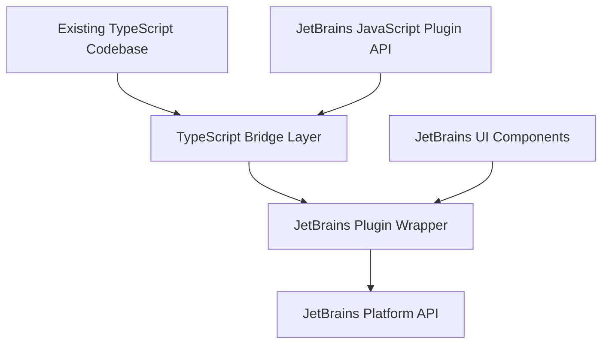

# Cline JetBrains Plugin: Implementation Plan

## 1. Project Overview

### Current State
- Cline is a VSCode extension built with TypeScript
- It provides AI-assisted coding capabilities through an agentic approach
- The codebase is organized with core functionality and VSCode-specific integrations

### Goal
- Create a JetBrains version (cline-jetbrains) that provides the same functionality
- Deploy to the JetBrains marketplace for use across the JetBrains ecosystem
- Maintain ability to sync changes from the main repository with minimal conflicts
- Keep the existing TypeScript codebase intact

## 2. Technical Architecture



### Key Components:

1. **Existing TypeScript Codebase** (Unchanged)
   - Core AI interaction logic
   - Command execution
   - File operations
   - All existing functionality

2. **TypeScript Bridge Layer** (New)
   - Thin adapter layer written in TypeScript
   - Provides interfaces for JetBrains-specific functionality
   - Minimal changes to ensure compatibility

3. **JetBrains Plugin Wrapper** (New)
   - Written in Java/Kotlin
   - Implements JetBrains Platform API integration
   - Loads and interacts with TypeScript code via JavaScript Plugin API
   - Provides JetBrains-specific UI components and services

## 3. Implementation Strategy

### Phase 1: Project Setup and Analysis (2 weeks)
1. **Create a new repository** for cline-jetbrains
   - Set up basic project structure
   - Configure build system (Gradle)
   - Set up initial plugin.xml configuration

2. **Analyze the existing codebase**
   - Identify integration points with VSCode API
   - Document dependencies and requirements
   - Map VSCode concepts to JetBrains equivalents

3. **Set up TypeScript integration**
   - Configure JavaScript Plugin API
   - Set up TypeScript compilation for JetBrains environment
   - Create initial bridge interfaces

### Phase 2: Core Integration (3-4 weeks)
1. **Implement JetBrains wrapper**
   - Create Java/Kotlin classes for JetBrains integration
   - Implement plugin lifecycle hooks
   - Set up communication between Java and TypeScript layers

2. **Adapt core functionality**
   - File system operations
   - Terminal integration
   - Editor integration
   - Settings management

3. **Implement UI components**
   - Main tool window
   - Settings panels
   - Notification system
   - Context menus and actions

### Phase 3: Feature Implementation (4-5 weeks)
1. **Implement all features from VSCode extension**
   - AI interaction
   - Command execution
   - File editing capabilities
   - Browser integration (if applicable)

2. **Testing and refinement**
   - Unit tests for Java/Kotlin code
   - Integration tests for TypeScript bridge
   - Manual testing across different JetBrains IDEs

### Phase 4: Deployment and Documentation (2 weeks)
1. **Prepare for JetBrains marketplace**
   - Create documentation
   - Prepare marketing materials
   - Set up licensing and distribution

2. **Establish synchronization workflow**
   - Document process for syncing from main repository
   - Create scripts to automate synchronization
   - Set up CI/CD pipeline

## 4. Technical Details

### TypeScript Integration

JetBrains provides a JavaScript Plugin API that allows plugins to use JavaScript/TypeScript. We'll leverage this to integrate the existing TypeScript codebase:

1. **JavaScript Plugin API Configuration**
   - Set up plugin.xml to declare JavaScript module
   - Configure TypeScript compilation settings
   - Set up module loading and initialization

2. **Bridge Interfaces**
   - Create TypeScript interfaces for JetBrains-specific functionality
   - Implement adapter patterns for platform differences
   - Use dependency injection to swap implementations

3. **Module Loading**
   - Load TypeScript modules from Java/Kotlin code
   - Pass JetBrains services to TypeScript modules
   - Handle lifecycle events

### JetBrains-Specific Components

1. **Tool Window**
   - Create main UI container
   - Implement panels and components
   - Handle user interactions

2. **Editor Integration**
   - Implement editor extensions
   - Handle document events
   - Provide code modification capabilities

3. **Terminal Integration**
   - Create terminal session management
   - Handle command execution
   - Process terminal output

4. **Settings Management**
   - Create settings UI
   - Store and retrieve configuration
   - Handle settings changes

## 5. Repository Structure

```
cline-jetbrains/
├── build.gradle                 # Gradle build configuration
├── src/
│   ├── main/
│   │   ├── java/                # Java/Kotlin code for JetBrains integration
│   │   │   └── com/cline/jetbrains/
│   │   │       ├── ClinePlugin.java     # Main plugin class
│   │   │       ├── ui/                  # UI components
│   │   │       ├── services/            # JetBrains services
│   │   │       └── actions/             # Menu actions and handlers
│   │   ├── resources/
│   │   │   ├── META-INF/
│   │   │   │   └── plugin.xml           # Plugin configuration
│   │   │   └── icons/                   # Plugin icons
│   │   └── ts/                          # TypeScript bridge code
│   │       ├── bridge/                  # Bridge interfaces
│   │       └── adapters/                # Platform adapters
│   └── test/                            # Test code
├── cline-core/                          # Submodule or copy of main repo
│   └── ...                              # Original TypeScript codebase
└── scripts/
    ├── sync.sh                          # Sync script for main repo changes
    └── build.sh                         # Build script
```

## 6. Synchronization Strategy

To maintain synchronization with the main repository while keeping changes minimal:

1. **Git Submodule or Copy**
   - Include the main repository as a Git submodule or copy
   - Keep the original structure intact

2. **Automated Sync Process**
   - Script to pull changes from main repository
   - Apply changes to the submodule/copy
   - Run tests to ensure compatibility

3. **Minimal Modifications**
   - Keep modifications to the original codebase to an absolute minimum
   - Implement all JetBrains-specific code in separate files
   - Use configuration to switch between platforms

## 7. Build and Deployment Process

1. **Build Process**
   - Compile TypeScript code
   - Compile Java/Kotlin code
   - Package resources
   - Create plugin JAR file

2. **Testing**
   - Run unit tests
   - Run integration tests
   - Manual testing in different JetBrains IDEs

3. **Deployment**
   - Sign plugin
   - Upload to JetBrains marketplace
   - Release management

## 8. Timeline and Milestones

1. **Project Setup (Weeks 1-2)**
   - Repository creation
   - Initial project structure
   - Build system configuration

2. **Core Integration (Weeks 3-6)**
   - TypeScript bridge implementation
   - JetBrains wrapper implementation
   - Basic functionality working

3. **Feature Implementation (Weeks 7-11)**
   - Implement all features
   - Testing and refinement
   - Performance optimization

4. **Deployment Preparation (Weeks 12-13)**
   - Documentation
   - Marketplace submission
   - Release management

## 9. Technical Challenges and Solutions

### Challenge 1: Different UI Paradigms
- **VSCode**: Uses HTML/CSS for UI via webviews
- **JetBrains**: Uses Swing or JavaFX for UI components
- **Solution**: Create JetBrains-specific UI components that provide equivalent functionality

### Challenge 2: API Differences
- **VSCode**: Uses specific extension API
- **JetBrains**: Uses IntelliJ Platform API
- **Solution**: Create adapter interfaces in the bridge layer

### Challenge 3: JavaScript Integration
- **Challenge**: Integrating TypeScript code with Java/Kotlin
- **Solution**: Use JavaScript Plugin API and create clear interfaces

### Challenge 4: Performance Considerations
- **Challenge**: Ensuring good performance across platforms
- **Solution**: Optimize critical paths, use caching, minimize cross-language calls

## 10. Resources Required

1. **Development Environment**
   - IntelliJ IDEA Ultimate (for plugin development)
   - JDK 17 or later
   - Node.js and npm

2. **Documentation**
   - JetBrains Platform SDK documentation
   - JavaScript Plugin API documentation
   - IntelliJ Platform Plugin Template

3. **Testing Resources**
   - Various JetBrains IDEs for testing
   - Test projects for different languages/frameworks

## 11. Next Steps

1. Set up the initial repository structure
2. Create a proof-of-concept for TypeScript integration
3. Implement basic UI components
4. Begin adapting core functionality